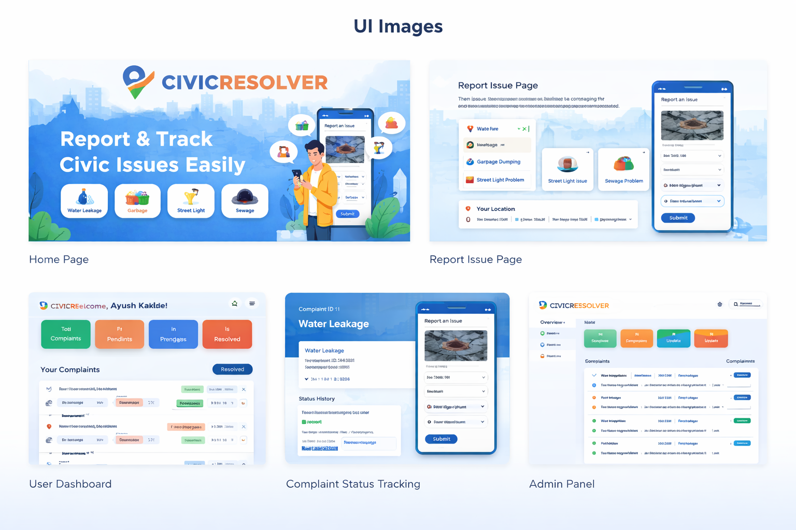

# 🏙️ CIVICRESOLVER



## 📌 Overview

CIVICRESOLVER is a web-based civic issue reporting platform that enables citizens to report local infrastructure and sanitation problems directly to municipal authorities.

The platform helps bridge the communication gap between citizens and government authorities by allowing users to report issues such as garbage dumping, water leakage, sewage problems, broken street lights, and other civic concerns.

Citizens can submit complaints, track their complaint status, and help authorities maintain better city infrastructure.

---

## 🚀 Features

✔ Easy civic issue reporting  
✔ Complaint tracking system  
✔ Categorized issue submission  
✔ User-friendly interface  
✔ Admin dashboard for complaint management  
✔ Fast and responsive UI  

---

## 🛠️ Tech Stack

### Frontend
- React.js
- HTML5
- CSS3
- JavaScript

### Backend
- Java
- Spring Boot
- Spring MVC
- REST APIs

### Database
- MySQL / MongoDB (use whichever you used)

### Tools
- Git
- GitHub
- VS Code
- Postman

---

## 📂 Project Structure

```
CIVICRESOLVER
│
├── frontend/        # React frontend application
│
├── backend/         # Spring Boot backend application
│
├── images/          # UI screenshots used in README
│   ├── home.png
│   ├── report.png
│   ├── dashboard.png
│   ├── complaint-status.png
│   └── admin-panel.png
│
└── README.md        # Project documentation
```


---

## 📸 UI Showcase

### 🏠 Home Page


---

### 📝 Report Issue Page


---

### 📊 User Dashboard


---

### 🔍 Complaint Status Tracking


---

### 🛠️ Admin Panel


---

## ⚙️ Installation & Setup

### 1️⃣ Clone the Repository

```bash
git clone https://github.com/yourusername/CIVICRESOLVER.git

2️⃣ Navigate to Project Directory
cd CIVICRESOLVER
▶️ Running the Backend (Spring Boot)

Navigate to backend folder

cd backend

Run the Spring Boot application

If using Maven:

mvn spring-boot:run

Or run the main class from your IDE.

Backend will start on:

http://localhost:8080
▶️ Running the Frontend (React)

Navigate to frontend folder

cd frontend

Install dependencies

npm install

Start the React app

npm start

Frontend will start on:

http://localhost:3000

🎯 Future Improvements

Real-time complaint status updates

Push notifications for users

Location-based issue reporting

Authentication and user profiles

Mobile responsive UI improvements

🤝 Contributing

Contributions are welcome.
Feel free to fork this repository and submit pull requests.

📜 License

This project is licensed under the MIT License.

👨‍💻 Author

Ayush Kakde
B.Tech Computer Science
Aspiring Java Full Stack Developer

GitHub: https://github.com/Kakdeayush
