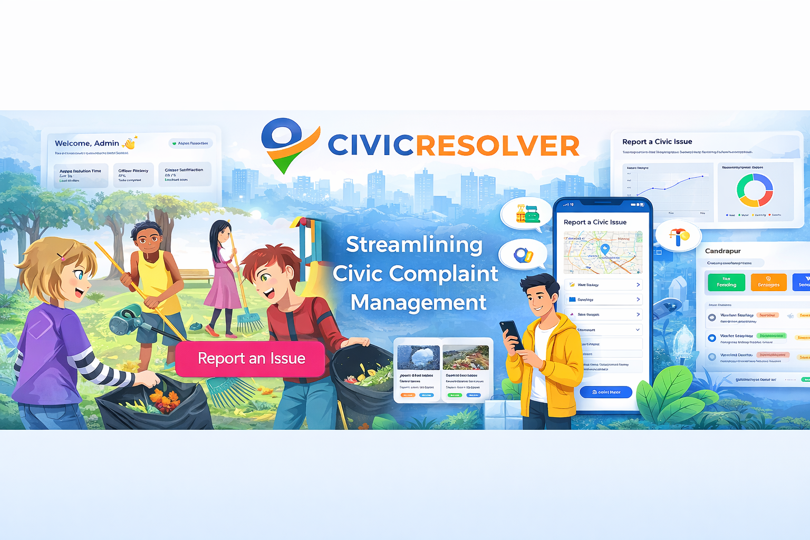
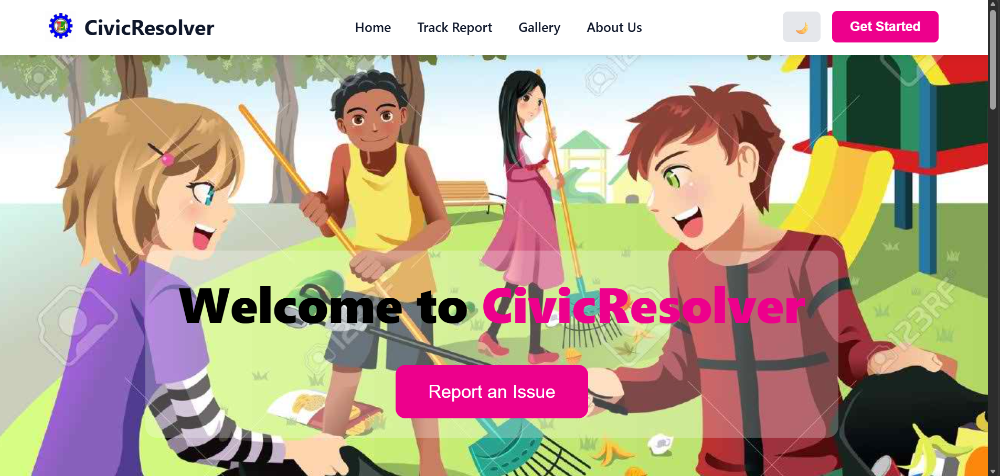
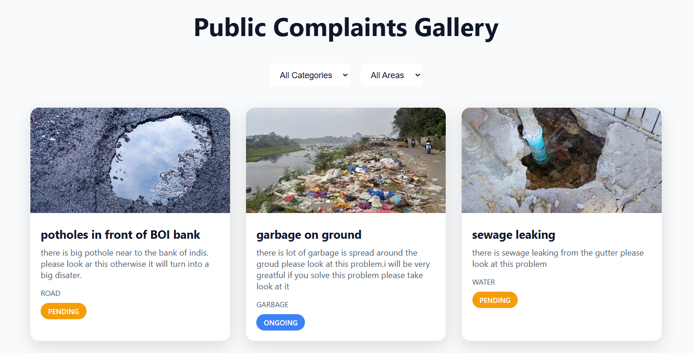
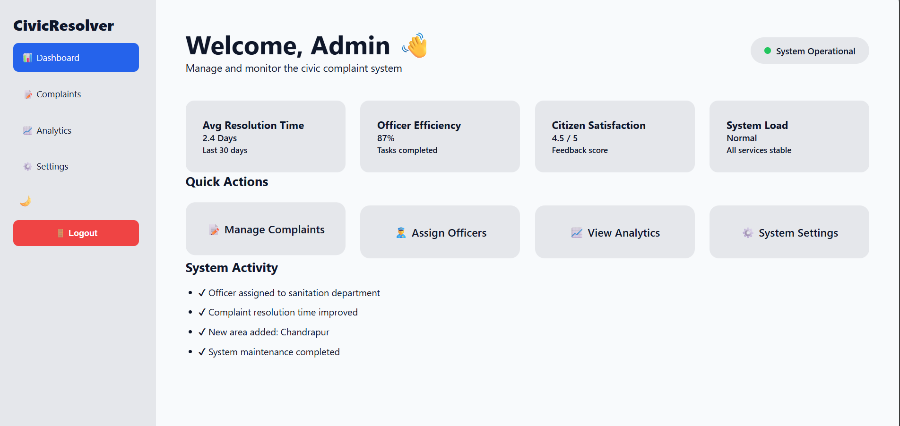
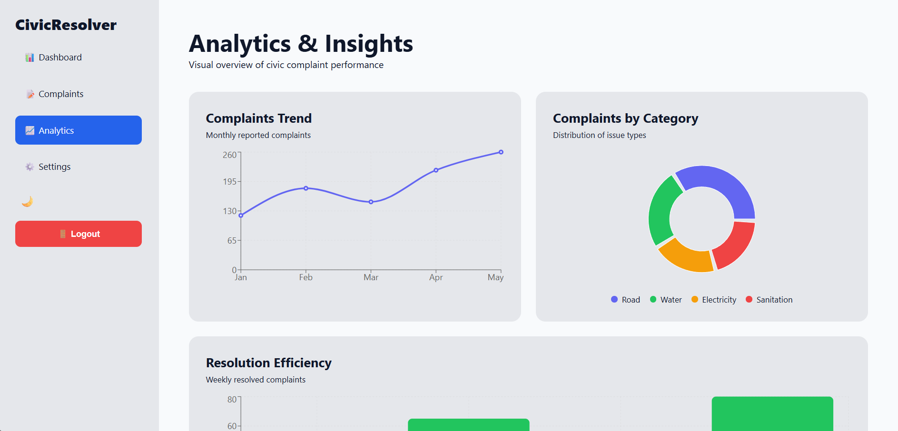

# 🏙️ CIVICRESOLVER



## 📌 Overview

CIVICRESOLVER is a web-based civic issue reporting platform that enables citizens to report local infrastructure and sanitation problems directly to municipal authorities.

The platform helps bridge the communication gap between citizens and government authorities by allowing users to report issues such as garbage dumping, water leakage, sewage problems, broken street lights, and other civic concerns.

Citizens can submit complaints, track their complaint status, and help authorities maintain better city infrastructure.

---

## 🚀 Features

✔ Easy civic issue reporting  
✔ Complaint tracking system  
✔ Categorized issue submission  
✔ User-friendly interface  
✔ Admin dashboard for complaint management  
✔ Fast and responsive UI  

---

## 🛠️ Tech Stack

### Frontend
- React.js
- HTML5
- CSS3
- JavaScript

### Backend
- Java
- Spring Boot
- Spring MVC
- REST APIs

### Database
- MySQL / MongoDB (use whichever you used)

### Tools
- Git
- GitHub
- VS Code
- Postman

---

## 📂 Project Structure

```
CIVICRESOLVER
│
├── frontend/        # React frontend application
│
├── backend/         # Spring Boot backend application
│
├── images/          # UI screenshots used in README
│   ├── home.png
│   ├── report.png
│   ├── dashboard.png
│   ├── complaint-status.png
│   └── admin-panel.png
│
└── README.md        # Project documentation
```


---

## 📸 UI Showcase

### 🏠 Home Page



---

### 🔍 Complaints Gallery



---

### 📊 Admin Dashboard



---

### 🛠️ Admin Analytics



---

## ⚙️ Installation & Setup

### 1️⃣ Clone the Repository

```bash
git clone https://github.com/Kakdeayush/CIVICRESOLVER.git
```
2️⃣ Navigate to the Project Directory
```bash
cd CIVICRESOLVER
```

▶️ Running the Backend (Spring Boot)

1.Navigate to the backend folder

```bash
cd backend
```

2.Run the Spring Boot application

If you are using Maven, run:
```bash
mvn spring-boot:run
```

Alternatively, you can run the main Spring Boot application class directly from your IDE.

Once the backend server starts, it will run on:
```bash
http://localhost:8080
```

▶️ Running the Frontend (React)

1.Navigate to the frontend folder
```bash
cd frontend
```

2.Install the required dependencies
```bash
npm install
```

3.Start the React development server
```bash
npm start
```

The frontend application will start running on:
```bash
http://localhost:3000
```

🎯 Future Improvements

#Real-time complaint status updates

#Push notification system for users

#Location-based issue reporting using maps

#User authentication and profile management

#Improved mobile responsive UI

🤝 Contributing

Contributions are welcome.
If you would like to improve this project, feel free to fork the repository and submit a pull request.

📜 License

This project is licensed under the MIT License.

👨‍💻 Author

Ayush Kakde
B.Tech Computer Science
Aspiring Java Full Stack Developer

GitHub:
https://github.com/Kakdeayush
